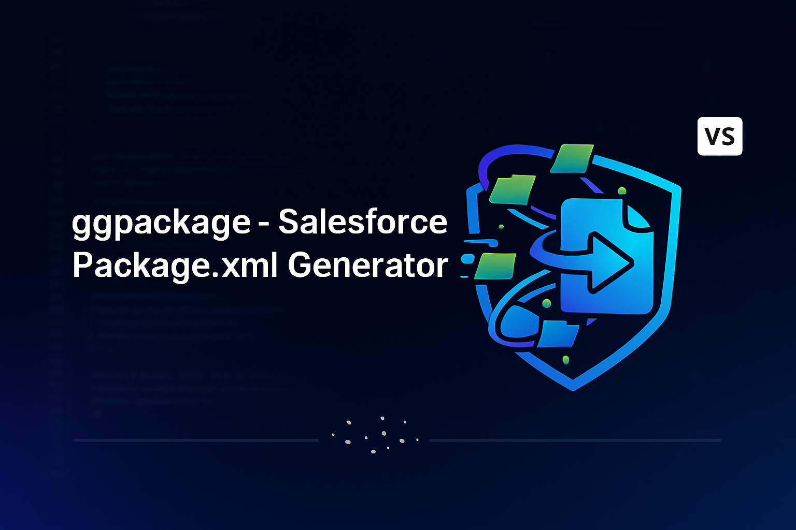

<p align="center">

</p>
<p align="center">
<a href="https://marketplace.visualstudio.com/items?itemName=ggarpelli.ggpackage">

</a>
<a href="https://marketplace.visualstudio.com/items?itemName=ggarpelli.ggpackage">

</a>
<a href="https://marketplace.visualstudio.com/items?itemName=ggarpelli.ggpackage&ssr=false#review-details">

</a>
</p>

# ggpackage: The Smart package.xml Generator

Tired of manually writing `package.xml` for every deployment? **ggpackage** is the ultimate tool to automate the creation of Salesforce manifests — right from your VS Code.

With just a few clicks, select files, folders, or changes from Source Control and instantly generate a clean, sorted, and ready-to-use `package.xml`.

---

## ✨ Features

✅ **Interactive Manifest Builder:**  
Quickly review, filter, and choose which components to include through an easy-to-use Quick Pick interface.

📂 **Contextual Generation:**  
Generate your manifest directly from the File Explorer or Source Control (modified/staged files).

⚡ **Automatic Pre-selection:**  
When invoked from selected files or folders, those components appear pre-selected in the list.

💅 **Automatic Formatting:**  
The generated `package.xml` is clean, well-formatted, and alphabetically sorted by metadata type and component name.

🚀 **Fast and Lightweight:**  
Runs entirely within VS Code — no CLI commands required.

---

## 🧭 How to Use

1. **Right-click** on any file or folder inside your Salesforce project (e.g. `force-app`).  
2. Choose **“ggpackage: Generate Package.xml...”** from the context menu.  
3. Review or adjust the selection in the popup list.  
4. Confirm your choice — and voilà!  
   A fully formatted `package.xml` will be created under the `/manifest` folder and opened automatically.

---

## 🧩 Example

**Selecting components:**

- Select `classes/`, `lwc/`, or even `objects/Account/` →  
  ggpackage identifies all relevant metadata automatically.

**Generated output:**

```xml
<?xml version="1.0" encoding="UTF-8"?>
<Package xmlns="http://soap.sforce.com/2006/04/metadata">
    <types>
        <members>Account</members>
        <name>CustomObject</name>
    </types>
    <types>
        <members>MyTrigger</members>
        <name>ApexTrigger</name>
    </types>
    <version>61.0</version>
</Package>
